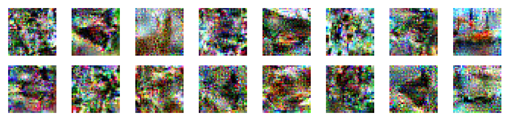

# Inverting Gradient Experiments

This directory contains the pipeline for conducting experiments on safe unlearning using the inverting gradient method. Below are the steps to execute the pipeline and perform the experiments.

The inverting gradient attack is inspired by the federated learning attack ["Inverting Gradients - How easy is it to break privacy in federated learning?"](https://arxiv.org/abs/2003.14053), which has been adapted for machine unlearning by Hu et al. (2024) in ["Learn What You Want to Unlearn: Unlearning Inversion Attacks against Machine Unlearning"](https://ieeexplore.ieee.org/abstract/document/10646717). Unlike the original setup, which uses single-step gradient ascent without retain data, this pipeline extends the attack to evaluate advanced unlearning methods like NegGrad+ and SCRUB. It incorporates multiple epochs and a retain set, highlighting potential vulnerabilities in sophisticated unlearning techniques.

The pipeline is built on a ResNet-18 model trained from scratch on the CIFAR-10 dataset. We intentionally use an overfitted model Data is divided into forget and retain sets to assess unlearning methods under various configurations. The `samples.sh` script ensures consistent data splits by listing the files used in each forget/retain set.

The `experiment_main.py` script handles unlearning and reconstruction processes sequentially, enabling flexible experimentation with different methods and parameters.

### Example Results
- **NegGrad+**: 16 unlearned samples, 50 retained samples, beta=0.1  



## Steps to Run the Experimentation Pipeline

1. **Data Splitting**  
    Split the data into training, validation, and test sets using the following commands:  
    ```bash
    source demos/InvertingGradients/samples.sh

    bash demos/InvertingGradients/1_generate_splits.sh "${unlearn1}" "${retain5}"
    ```
    Replace `"${unlearn1}"` and `"${retain5}"` with other options as needed:
    - **Unlearning sizes**: `"${unlearn1}"`, `"${unlearn8}"`, `"${unlearn16}"`, `"${unlearn32}"`
    - **Retain sizes**: `"${retain1}"`, `"${retain5}"`, `"${retain25}"`, `"${retain50}"`

    These commands ensure consistent data splits that were used in reporting experimental results.

2. **Model**  
    The model used for experiments is provided under `models/`. It is a ResNet-18 trained for 15 epochs using the Adam optimizer with a learning rate of 0.01.  

    **Performance Metrics**:  
    - **Training Accuracy**: 95.46%
    - **Validation Accuracy**: 72.74%

    The model overfits, as indicated by the gap between training and validation performance.

## Running Final Experiments

To run multi-run experiments, use the following commands:

1. **NegGrad Experiments**:  
    ```bash
    python demos/InvertingGradients/experiment_main.py -m epochs=1,2,3 method=neggradplus seed=0,1 
    ```

2. **NegGrad+ Experiments with Varying Betas**:  
    ```bash
    python demos/InvertingGradients/experiment_main.py -m epochs=1,2 method=neggradplus seed=0,1 beta=0.1,0.2,0.3,0.4,0.5,0.6,0.75
    ```

For individual experiments, specify single values for configuration parameters. Refer to `exp.yaml` for configurable parameters. For example, to run a single NegGrad experiment with 2 unlearning epochs, use:  
```bash
python demos/InvertingGradients/experiment_main.py epochs=2 method=neggrad verbose=true
```

Follow these steps sequentially to ensure the pipeline runs correctly. To experiment with different forget and retain sizes, repeat step 1 with new configurations.

For further extensibility, modify the unlearner or reconstructor classes in the `src/` directory. For instance, you can adjust the SCRUB loss function to calculate KL + CE on the forget set.


## References

- Jonas Geiping, Hartmut Bauermeister, Hannah Dröge, and Michael Moeller. [Inverting Gradients – How easy is it to break privacy in federated learning?](https://arxiv.org/abs/2003.14053), arXiv preprint arXiv:2003.14053, 2020.
- Hongsheng Hu, Shuo Wang, Tian Dong, Minhui Xue. ["Learn What You Want to Unlearn:  Unlearning Inversion Attacks against Machine Unlearning"](https://ieeexplore.ieee.org/abstract/document/10646717), IEEE S&P, 2024. 
